# 💸 우아한 가계부

> **TEAM. `🧑🏻‍💻 동진 && 👩🏻‍💻 그림`**

<p align="center">
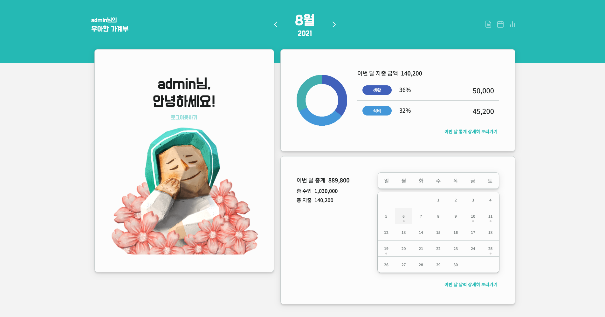
<p>
    
<h3 align="center">
  <a href="http://13.125.71.167:5000">http://13.125.71.167:5000</a>
</h3>

<p align="center">✨&nbsp; 우아한 소비 습관을 만들어주는 우아한 가계부 프로젝트 ✨</p>

## 사용 기술

- **Common** Yarn / ESLint(airbnb-base) / Prettier
- **Front-End** Webpack / Babel / JavaScript / SCSS
- **Back-End** Node.js / Express / Sequelize ORM
- **ETC** AWS EC2 / Github / Slack

### Chart 패키지 배포

- Donut Chart ([donut-chart-js](https://www.npmjs.com/package/donut-chart-js))
- Linear Chart ([linear-chart-js](https://www.npmjs.com/package/linear-chart-js))

## 프로젝트 구조

### Client

```bash
client
├── config              # 웹팩 설정
├── public              # 정적 파일(index.html/favicon/...)
└── src
    |   index.js        # App entry point
    ├── assets          # 필요한 리소스들
    ├── lib             # 핵심 요소들(Component/Router/Observable...)
    ├── store           # Model
    ├── styles          # 공통 스타일
    ├── utils           # 범용 함수들
    └── views           # View
        ├── components
        ├── pages
        └── index.js
```

### Server

```bash
server/src
│   app.js              # App entry point
├── config              # 환경변수 및 설정
├── loaders             # 시작 프로세스 모듈화 (express, sequelize, logger)
├── models              # 데이터베이스 핸들링 (sequelize)
├── services            # 비즈니스 로직
└── api
    ├── routes          # routes & controllers
    ├── middlewares     # middlewares
    └── index.js
```

### 데이터베이스 스키마

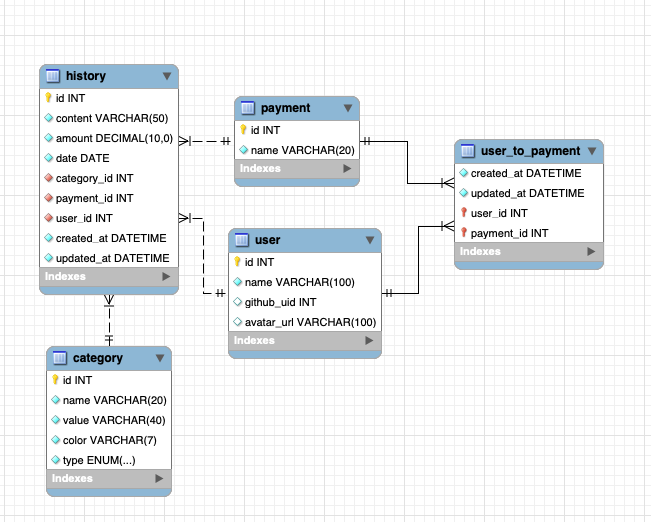

## 설치 및 실행

### 환경 변수 설정

`client`, `server` 각 디렉토리의 `.env.example` 파일을 참고하여 `.env` 파일을 생성해주세요.

### 실행 방법

#### Frontend - Development mode

```bash
cd client
yarn install
yarn run dev
```

#### Backend - Development mode

```bash
cd server
yarn install
yarn run dev
```

#### Production mode

```bash
cd client
yarn build
cd ../server
yarn start
```

## 실행 결과

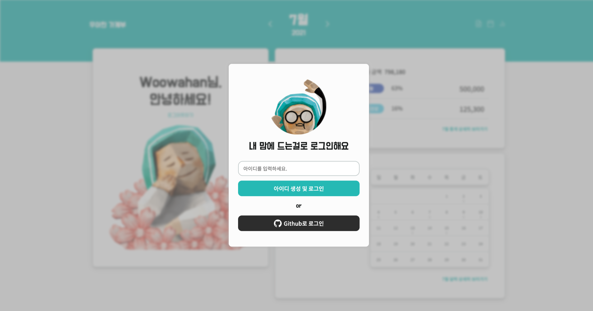 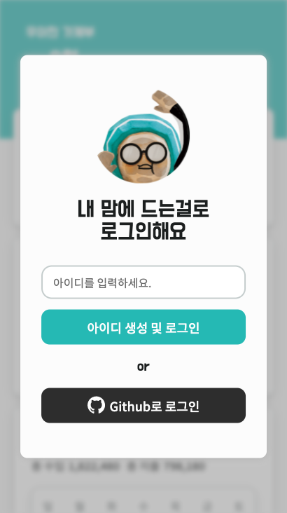

 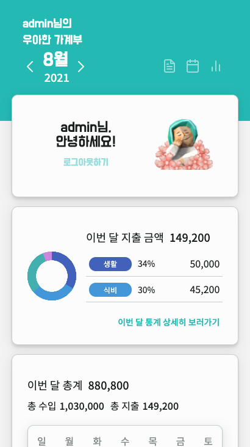

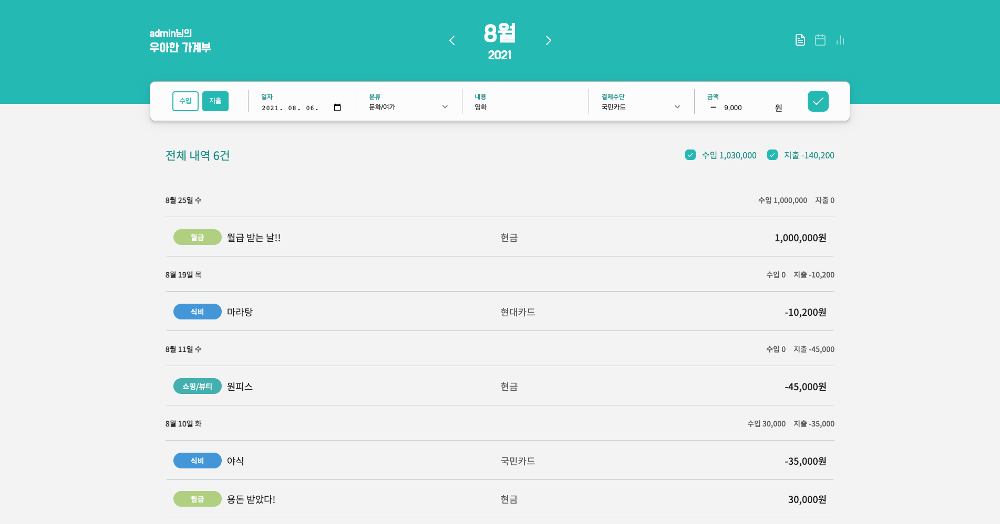 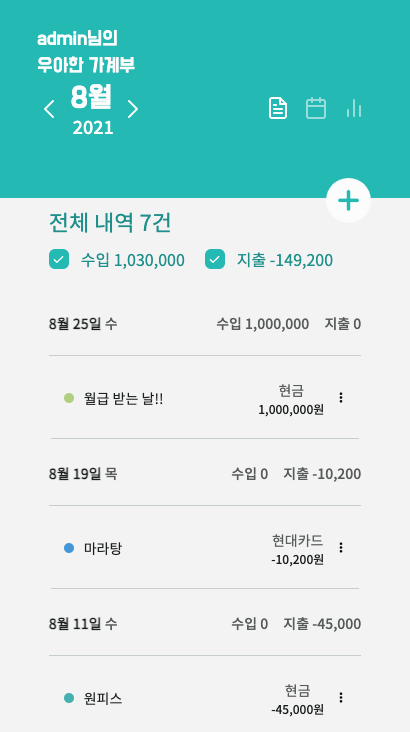 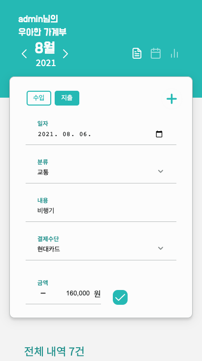

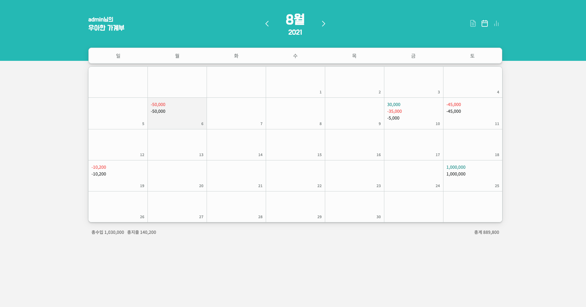 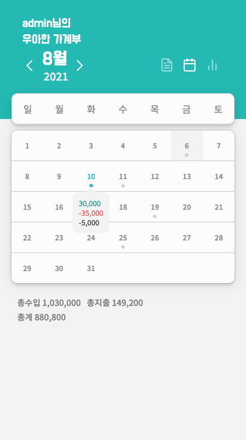

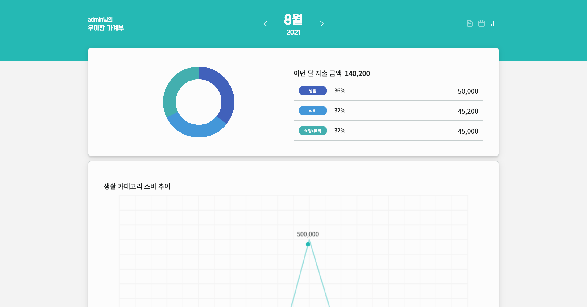 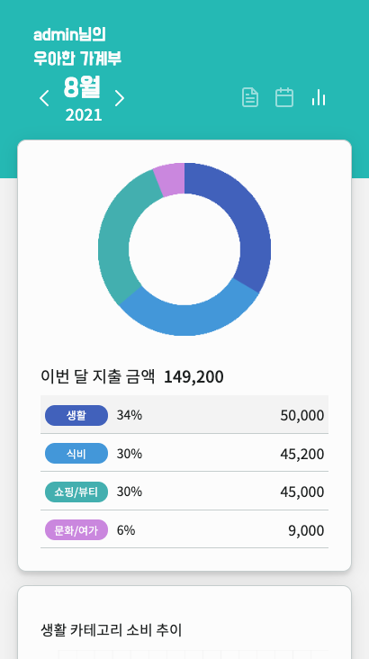
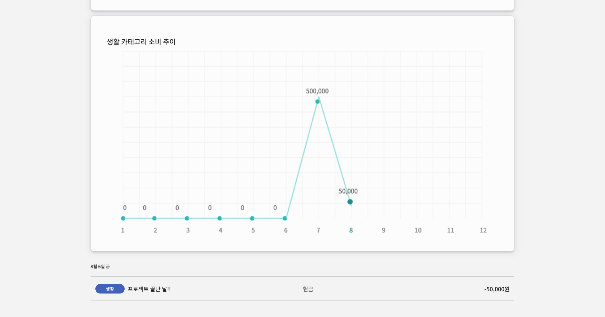 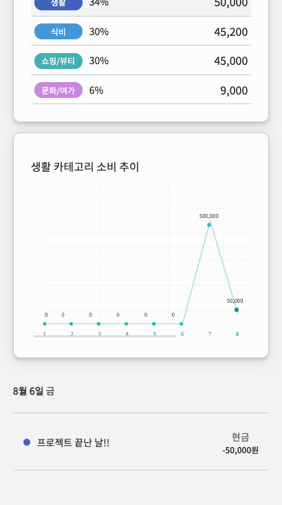

## 라이센스

MIT 2021 © [dongqui](https://github.com/dongqui), [Seogeurim](https://github.com/Seogeurim)
